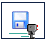

Introduction to the tasks
==============================

As mentioned before, following this tutorial you will learn to program
by having Reeborg perform certain tasks. To know more about a specific
task, you can click on the **World Info** button to display some information
about that task. Clicking repeatedly on that button either shows or hides
the window with that information.

Tasks can be separated in two groups:

- Fixed: a task is fixed if Reeborg and all the objects in the world, including the walls and the marker for the final position, are always the same.
- Variable: a task is variable if it can look different each time it is loaded or when a program is run.

Currently, you do not know enough to write programs for variable tasks.
When you learn about the techniques required to write programs for
variable tasks, you will see that they make it possible to also write
shorter programs to solve fixed tasks.

The fixed tasks include: 

-  **Home 1, 2, 3, 4**
-  **Around 1, 2, 3, 4**
-  **Harvest 1**
-  **Hurdle 1**
-  **Newspaper 0**
-  **Rain 0**
-  **Tokens 1, 2, 3, 4, 5**

There is one more fixed task, namely **Newspaper 1**, but you will
first need to learn about something called an argument of a function
before you can write a program that enables Reeborg to accomplish the required task easily.

You should try to write programs for at least a few of these tasks.

While you write your programs, each of which will consist of a specific
of series of instructions, you have the advantage of seeing the entire
world all at once. You should start to think about how Reeborg, who only sees the
grid square where he is located, could take advantage of clues to
determine its next action; this will be useful later on.

Important information about saving your work
--------------------------------------------

By making use of something known as *Local Storage*, Reeborg's World remembers
the last program you work on in a given browser (Firefox or Chrome).
However, it might be useful for you to save your programs on your computer,
or on a usb key.  You can do so, either by clicking on the button identified with
this image: |image|

If you do save your programs, you will have to note for which
world they are designed. To do so you can use comments::

    # Solution to world Home 1
    move()
    move()

.. admonition:: For educators

    If you have already explained how to use function arguments, it might
    be useful to suggest the use of the ``World()`` function instead
    of simply using comments::

        World("Home 1")
        move()
        move()

    If the world currently displayed is not
    **Home 1**, then running this program will result in the selected
    world changing to **Home 1** and the rest of the program will be ignored.
    Running it a second time (when the world shown **is** the desired
    world **Home 1**), the ``World()`` function will be ignored and the rest
    of the program will be executed.

    Instead of using pre-defined worlds, you can use any world accessible
    by a URL somewhere on the web - perhaps on your own server or
    on a public repository like pastebin.  For example, you might want to
    try the following::

        World("http://personnel.usainteanne.ca/aroberge/reeborg/token.json",
              "Token test")
        move()
        move()
        take()

    Running this program should add one more world to the current selection.
    Note the second (optional) argument to ``World`` which, if provided,
    is used as the name appearing in the world selector.

