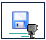

Introduction aux missions
=========================

Bonjour programmeur anonyme,

Votre mission, si vous l'acceptez, consiste à apprendre la programmation en aidant Reeborg à accomplir certaines tâches.

Pour en savoir davantage au sujet d'une tâche particulière que vous aurez choisie, vous pouvez cliquer sur le
bouton **Description** si la fenêtre qui décrit la tâche à accomplir n'est pas visible.

Les tâches peuvent être divisées en deux groupes:

- Fixes : une tâche est fixe si Reeborg et tous les objets dans le monde, incluant les murs et l'indicateur de la position finale, sont toujours les mêmes.
- Variables : une tâche est variable si certains éléments peuvent changer à chaque fois que le monde est choisi ou qu'un programme est exécuté.

Pour l'instant, vous n'en savez pas assez pour pouvoir écrire des programmes permettant de compléter des tâches variables. Lorsque vous saurez comment le faire, vous verrez également comment ceci vous permet d'écrire des programmes beaucoup plus courts pour les tâches fixes.

Les tâches fixes comprennent:

- **But 1, 2, 3, 4**
- **Autour 1, 2, 3, 4**
- **Récolte 1**
- **Haies 1**
- **Journal 0**
- **Pluie 0**
- **Jetons 1, 2, 3, 4, 5**

Il y a une autre tâche fixe, **Journal 1**, mais vous aurez besoin d'apprendre ce qu'est un argument de fonction avant de pouvoir aider Reeborg à accomplir cette tâche.

Vous devriez écrire des programmes pour accomplir au moins
quelques-unes des tâches fixes avant de poursuivre votre apprentissage.

Lorsque vous allez écrire vos programmes, vous aurez l'avantage de voir
le monde dans son ensemble. Vous devriez chercher à vous identifier à
Reeborg, qui ne voit que le carré où il se trouve, et imaginer comment
vous pouvez vous baser sur cette vue limitée pour décider quelle devrait
être la prochaine action.

Sauvegarde de votre travail
---------------------------

En utilisant "l'entreposage local" (*Local Storage*), le Monde de Reeborg
se souvient du **dernier** programme que vous avez exécuté dans votre
navigateur (Chrome ou Firefox). Cependant, ce serait parfois
utile de sauvegarder un certain programme soit sur votre ordinateur
ou sur un clé usb.  Pour ce faire, vous n'avez qu'à cliquer sur le bouton identifié par cette image: |image|

Si vous
sauvegardez un programme, il serait probablement utile d'ajouter de
l'information indiquant pour quelle monde ce programme représente une
solution. Une façon de le faire est d'ajouter un commentaire - ce que
vous savez comment faire si vous avez lu les leçons précédentes::

    # Solution du monde But 1
    avance()
    avance()

.. admonition:: Pour les enseignants

    Si vous avez expliqué l'utilisation d'arguments de fonctions, il pourrait
    être utile de suggérer l'utilisation de la commande ``Monde()`` plutôt
    que de simplement écrire un commentaire::

        Monde("But 1")
        avance()
        avance()

    Si le monde choisi à l'écran n'est pas le monde "But 1", l'exécution de
    ce programme fera en sorte que la sélection change au monde "But 1",
    et le reste du programme sera ignoré.  Si on l'exécute une deuxième fois
    (alors que le monde choisi est bel et bien "But 1"), l'instruction
    ``Monde()`` sera ignorée et le reste du programme sera exécuté correctement.

    Au lieu de monde prédéfini, vous pouvez utilisez des mondes définis
    à quelque part sur le web.  Par exemple::

        Monde("http://personnel.usainteanne.ca/aroberge/reeborg/token.json",
              "test jeton")
        avance()
        avance()
        prend()

    devrait en principe fonctionner, et ajouter ce nouveau monde au menu
    des mondes disponibles. Notez le deuxième argument (optionnel) qui
    permet d'avoir un nom plus court apparaissant dans le sélecteur.
